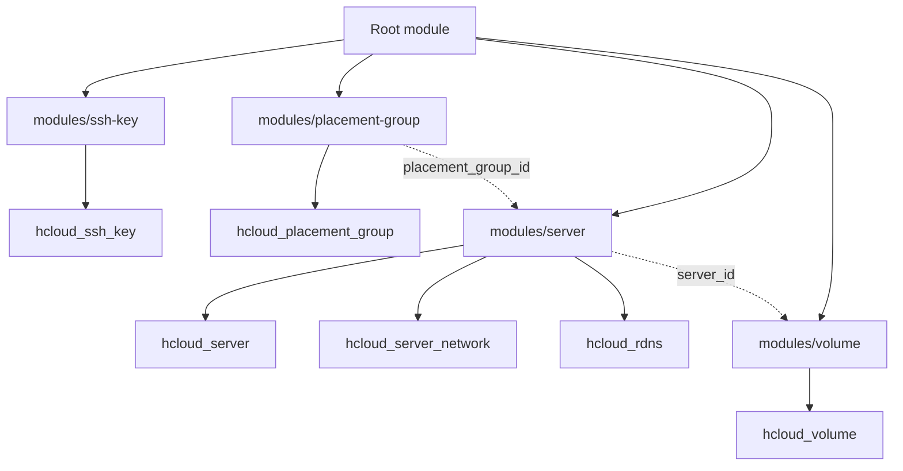

# Architecture

This module provisions a Hetzner Cloud server and optional supporting resources (SSH key, placement group, and volume) in a single composable root module.

## High-level design

- **Root module (`../../`)**: Orchestrates submodules and wires dependencies (e.g., placement group ID into server; server ID into volume).
- **`modules/ssh-key`**: Creates an `hcloud_ssh_key` when enabled.
- **`modules/placement-group`**: Creates an `hcloud_placement_group` when enabled.
- **`modules/server`**: Creates the `hcloud_server` plus optional `hcloud_server_network` attachments and `hcloud_rdns` entries.
- **`modules/volume`**: Creates an `hcloud_volume` and attaches it to the server when enabled.

## Mermaid diagram

